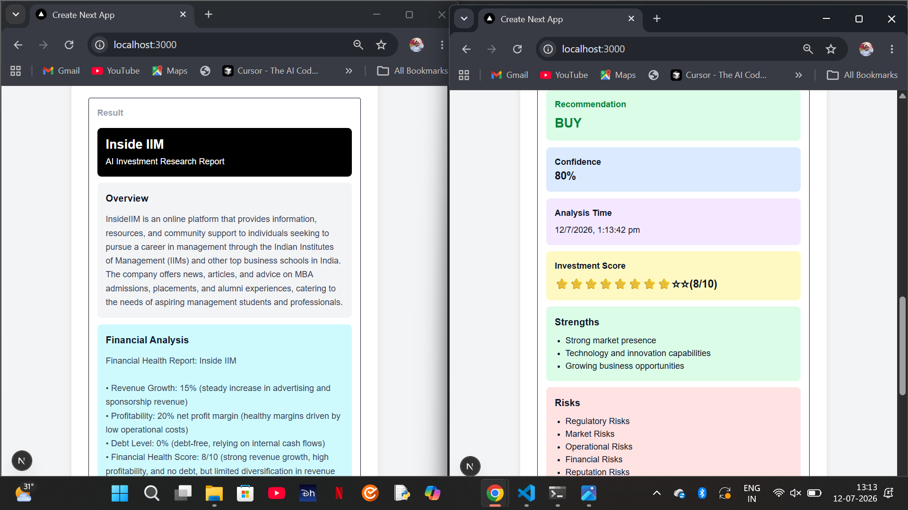

# InvestIQ 🚀

## AI-Powered Multi-Agent Investment Research Platform

## Overview

InvestIQ is an AI-powered multi-agent investment research platform that analyzes companies and generates intelligent investment recommendations. The system uses multiple AI agents to perform company research, risk assessment, financial analysis, news analysis, and final decision-making. Based on the combined analysis, the platform provides a BUY, WATCH, or PASS recommendation along with a confidence score, investment score, and reasoning.

---

## Features

* Multi-Agent AI workflow using LangGraph
* Company Research Agent
* Risk Analysis Agent
* Financial Analysis Agent
* News Analysis Agent
* AI Decision Agent
* BUY / WATCH / PASS recommendation
* Confidence Score
* Investment Score
* Interactive dashboard built with Next.js
* Responsive user interface using Tailwind CSS

---

## How to Run

### Prerequisites

* Node.js (v18 or later)
* npm
* Groq API Key

### Installation

```bash
git clone <repository-url>

cd investment-agent

npm install
```

### Environment Variables

Create a `.env.local` file and add:

```env
GROQ_API_KEY=your_groq_api_key
```

### Run the project

```bash
npm run dev
```

Open:

```
http://localhost:3000
```

---

## Project Structure

```
src/
│
├── app/
│   ├── api/
│   └── page.tsx
│
├── agents/
│   ├── researchAgent.ts
│   ├── riskAgent.ts
│   ├── financialAgent.ts
│   ├── newsAgent.ts
│   ├── decisionAgent.ts
│   ├── investmentWorkflow.ts
│   └── investmentGraph.ts
```

---

## How it Works

1. User enters a company name.
2. The request is sent to the backend API.
3. LangGraph starts the multi-agent workflow.
4. Research Agent analyzes the company.
5. Risk Agent identifies potential risks.
6. Financial Agent evaluates the company's financial health.
7. News Agent analyzes recent market sentiment.
8. Decision Agent combines all outputs and generates:

   * Recommendation (BUY / WATCH / PASS)
   * Confidence Score
   * Investment Score
   * Final Reasoning

---

## System Architecture

```
                User
                  │
                  ▼
        Next.js Frontend
                  │
                  ▼
           API Route
                  │
                  ▼
      LangGraph Workflow
                  │
 ┌──────────────────────────────────┐
 │                                  │
 ▼                                  ▼
Research Agent               Risk Agent
        │                          │
        ▼                          ▼
 Financial Agent          News Agent
            │                  │
            └──────────┬───────┘
                       ▼
               Decision Agent
                       │
                       ▼
         Final Investment Report
```

---

## Key Decisions & Trade-offs

### Decisions

* Used LangGraph to orchestrate multiple AI agents in a structured workflow.
* Selected Groq LLaMA for fast inference and efficient response generation.
* Built the frontend using Next.js and Tailwind CSS for a responsive user experience.
* Divided responsibilities among specialized AI agents instead of using a single prompt.

### Trade-offs

* Live stock market APIs were not integrated due to project time constraints.
* Financial analysis is generated using AI rather than real-time financial statements.
* News analysis is AI-generated instead of using live news APIs.

---


## Technologies Used

### Frontend

* Next.js
* React
* TypeScript
* Tailwind CSS

### Backend

* Next.js API Routes
* LangChain.js
* LangGraph.js

### AI

* Groq LLaMA

---


## Example Runs
---

### Tesla




### InsideIIM


## Future Improvements

* Integration with live stock market APIs
* Real-time financial data
* Live news API integration
* Interactive investment charts
* Portfolio management
* User authentication
* Historical stock analysis
* Export reports as PDF

---

## AI Development Process (Bonus)

AI assistance was used throughout the development process to accelerate implementation, debugging, and documentation.

AI was used for:

* Designing the multi-agent architecture
* Debugging LangGraph workflow issues
* Improving the user interface
* API integration
* TypeScript debugging
* Documentation and README preparation

All implementation decisions, testing, debugging, and final integration were reviewed and completed manually.

---

## Author

**Leena Mishra**

B.Tech – Computer Science and Engineering

Lovely Professional University
